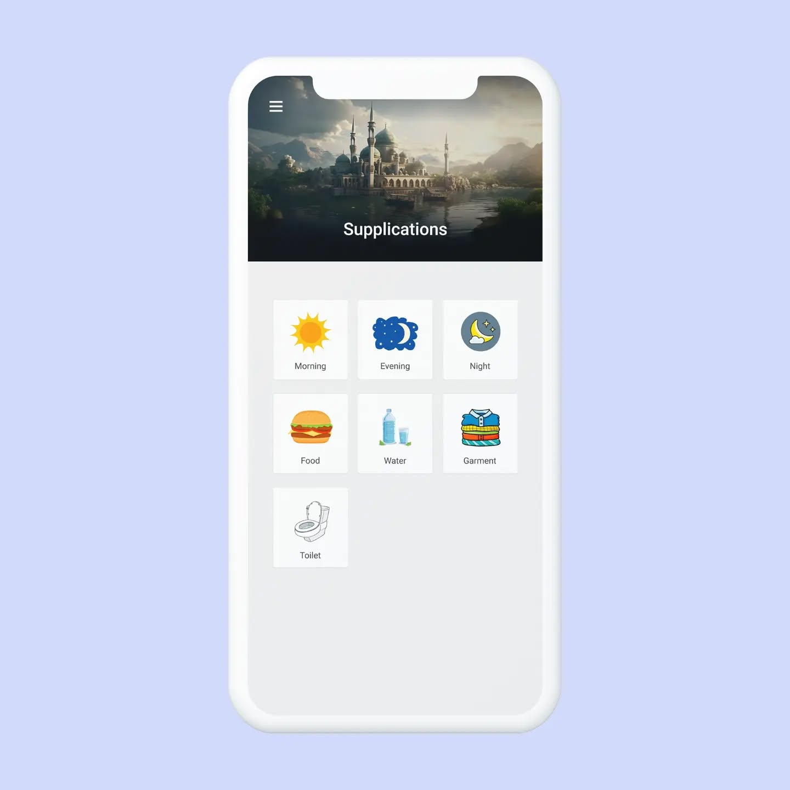
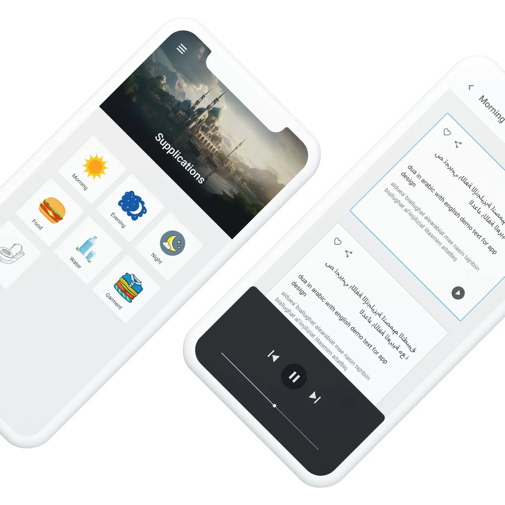

# Supplications App

A mobile application built with Flutter that provides a collection of Islamic supplications (duas) and remembrances (azkars) for daily use.

  
  
  

## Features

### Supplications Collection

- Categorized supplications for different occasions and needs
- Arabic text with English translations
- Romanized Arabic transliteration for non-Arabic speakers

### Audio Support

- High-quality audio recitations for each supplication
- Audio playback controls for listening to supplications

### User Experience

- Beautiful and intuitive interface
- Favorites system to save frequently used supplications
- Categorized browsing for easy navigation
- Share supplications with others

### Offline Support

- Save favorite supplications for offline access
- Local data persistence with Hive

## Technical Stack

### Framework & UI

- Flutter for cross-platform mobile development
- Material Design components
- Responsive UI that works on various device sizes

### State Management

- BLoC pattern with flutter_bloc for robust state management
- Repository pattern for data access

### Backend & Storage

- Firebase Cloud Firestore for data storage
- Audio streaming for supplication recitations
- Hive for local storage and favorites persistence

### Key Dependencies

- firebase_core & cloud_firestore - Backend services
- flutter_bloc & equatable - State management
- just_audio - Audio playback functionality
- cached_network_image - Efficient image loading
- hive & hive_flutter - Local storage
- share_plus - Sharing functionality
- upgrader - In-app update notifications
